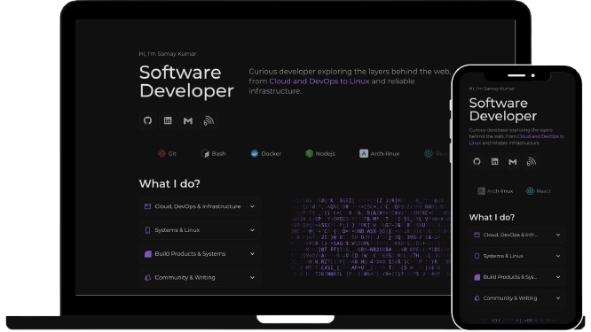

# Portfolio Website
Personal portfolio website built with Astro and React, fully containerized, CI/CD enabled and self-hosted on an Oracle Cloud Infrastructure (OCI) server.

## Overview
This project is a personal portfolio website developed to demonstrate practical skills in modern web development, containerization, cloud infrastructure, and CI/CD automation.

The application is built using Astro and React, fully dockerized, and deployed on a self-hosted Oracle Cloud server. The deployment pipeline includes automated image builds, blue–green deployment for zero downtime, secure HTTPS configuration, and controlled network access.

The project focuses on real-world deployment practices rather than just frontend design, covering infrastructure setup, automation, and production-level hosting.

Live version:
**[https://samay15jan.com](https://samay15jan.com)**



## Key Highlights
- Designed and deployed a production-ready portfolio using Astro and React
- Implemented CI/CD pipeline with GitHub Actions and Docker image builds
- Deployed using blue–green strategy for zero-downtime updates
- Self-hosted on Oracle Cloud Infrastructure with NGINX reverse proxy
- Secured with HTTPS (Let’s Encrypt) and firewall rules using UFW

## Tech Stack

* Astro
* React (TypeScript)
* Node.js
* Docker & Docker Compose
* NGINX
* GitHub Actions
* Oracle Cloud Infrastructure (OCI)
* Let’s Encrypt (HTTPS)

## Project Structure

```
public/
└── svg/

src/
├── Components/
│   ├── contact.astro
│   ├── footer.astro
│   ├── home.astro
│   ├── logoWall.astro
│   ├── nav.astro
│   └── projects.astro
│
├── layouts/
│   └── Layout.astro
│
├── React/
│   ├── LetterGlitch.tsx
│   ├── LikeButton.tsx
│   └── SkillsList.tsx
│
└── pages/
    └── index.astro
```

## Deployment Overview

The portfolio is fully self-hosted on an Oracle Cloud VM and follows an automated deployment pipeline.

### Infrastructure

* Oracle Cloud VM (Linux | Ubuntu)
* NGINX as reverse proxy
* UFW firewall for port management
* Docker-based application hosting
* HTTPS via Let’s Encrypt

## Deployment Timeline

### Day 1

* Setup OCI account and compute instance
* Server initialization and SSH access
* Installed NGINX and Docker
* Dockerized the portfolio application
* Created Dockerfile and docker-compose.yml
* Configured GitHub Actions to build Docker images

### Day 2

* Improved Dockerfile and folder structure using industry standards
* Implemented blue–green deployment architecture
* Created automated deployment script (GitHub Gist)
* Updated GitHub Actions workflow for full automation

### Day 3

* Purchased domain name
* Configured DNS and connected domain to server
* Enabled HTTPS using Let’s Encrypt
* Managed open ports using UFW
* Final OCI network and security configuration

## Deployment Features

* Fully Dockerized application
* Blue–green deployment for zero downtime
* Automated CI/CD using GitHub Actions
* Script-based server deployment
* Secure HTTPS configuration
* Cloud-ready and easily portable to other providers

---

## Local Development

### Clone the repository

```bash
git clone https://github.com/samay15jan/portfolio
```

### Install dependencies

```bash
npm install
```

### Run development server

```bash
npm run dev
```


## Docker Setup

The project includes a complete Docker-based setup for local and cloud deployment.

### Build image

```bash
docker build -t portfolio .
```

Or can pull the latest image from github packages:

```bash
docker pull ghcr.io/samay15jan/portfolio
```

### Run using Docker Compose

```bash
docker-compose up -d
```

---

## Build

```bash
npm run build
```

Production files are generated inside the `dist/` directory.

---

## License

This project is licensed under the MIT License.

Original base repository:
[https://github.com/gothsec/portfolio](https://github.com/gothsec/portfolio)